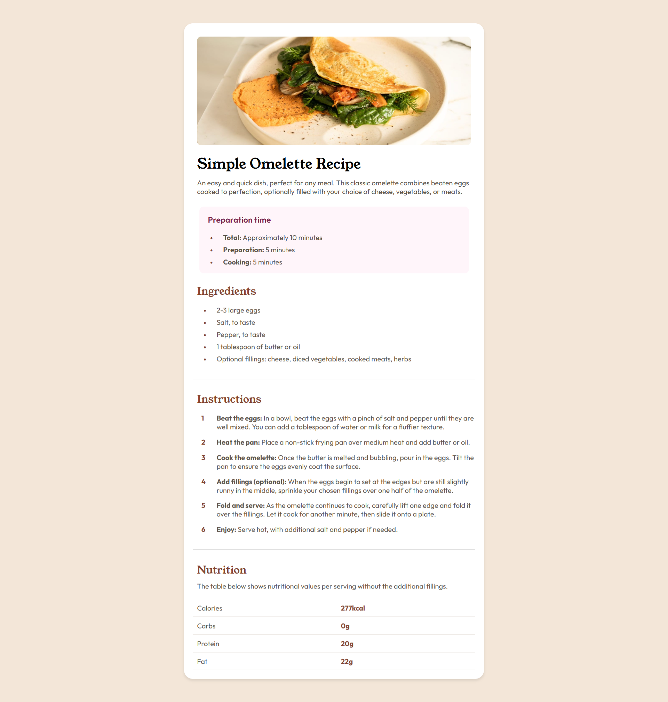

# Frontend Mentor - Recipe page solution

This is a solution to the [Recipe page challenge on Frontend Mentor](https://www.frontendmentor.io/challenges/recipe-page-KiTsR8QQKm). Frontend Mentor challenges help you improve your coding skills by building realistic projects. 

## Table of contents

- [Overview](#overview)
  - [The challenge](#the-challenge)
  - [Screenshot](#screenshot)
  - [Links](#links)
- [My process](#my-process)
  - [Built with](#built-with)
  - [What I learned](#what-i-learned)
  - [Continued development](#continued-development)
  - [Useful resources](#useful-resources)
- [Author](#author)

## Overview

### Screenshot

Screenshot of my final result:




### Links

- Live Site URL: [Live Site](https://arikiller.github.io/Recipe-Page-Main/)

## My process

Started with the HTML structure, I quickly noticed the different types of elements that need to be used for this challenge, two different types of lists, <ul> unorganised and <ol> that is organised, also there is a table at the very end, not finished though, I dont know how to make it look like the preview.

Did some variables on the CSS file for the colours for the first time, makes it all really easy.

I have noticed improvement making the style, I finally find myself comfortable as I know better how things work by now.

### Built with

- Semantic HTML5 markup
- CSS custom properties


### What I learned

I know how to make variables and how to use them properly.

I have a better eye to make the proportions right than before.

I have learned that you can style various things at the same time, rather than doing it one by one.

I have learned how to style all the different kinds of lists.

I know how to make separations in between sections to make it look cleaner and organised.

My HTML:

```html
<div class="card">
    

    <div class="title">
      <h1>Simple Omelette Recipe</h1>
      <p>An easy and quick dish, perfect for any meal. This classic omelette combines beaten eggs cooked
      to perfection, optionally filled with your choice of cheese, vegetables, or meats.</p>
    </div>

    <div class="preparation">
      <h3>Preparation time</h3>
      <ul class="time-list">
        <li><strong>Total:</strong> Approximately 10 minutes</li>
        <li><strong>Preparation:</strong> 5 minutes</li>
        <li><strong>Cooking:</strong> 5 minutes</li>
      </ul>
    </div>

    <div class="ingredients">
      <h2>Ingredients</h2>
      <ul class="ingredients-list">
        <li>2-3 large eggs</li>
        <li>Salt, to taste</li>
        <li>Pepper, to taste</li>
        <li>1 tablespoon of butter or oil</li>
        <li>Optional fillings: cheese, diced vegetables, cooked meats, herbs</li>
      </ul>
    </div>

    <div class="separator"></div>

    <div class="instructions">
      <h2>Instructions</h2>
      <ol class="instructions-list">
        <li><strong>Beat the eggs:</strong> In a bowl, beat the eggs with a pinch of salt and pepper until they are well mixed. 
        You can add a tablespoon of water or milk for a fluffier texture.</li>
        <li><strong>Heat the pan:</strong> Place a non-stick frying pan over medium heat and add butter or oil.</li>
        <li><strong>Cook the omelette:</strong> Once the butter is melted and bubbling, pour in the eggs. Tilt the pan to ensure 
        the eggs evenly coat the surface.</li>
        <li><strong>Add fillings (optional):</strong> When the eggs begin to set at the edges but are still slightly runny in the 
        middle, sprinkle your chosen fillings over one half of the omelette.</li>
        <li><strong>Fold and serve:</strong> As the omelette continues to cook, carefully lift one edge and fold it over the 
        fillings. Let it cook for another minute, then slide it onto a plate.</li>
        <li><strong>Enjoy:</strong> Serve hot, with additional salt and pepper if needed.</li>
      </ol>
    </div>

    <div class="separator"></div>

    <div class="nutrition">
      <h2>Nutrition</h2>
      <p>The table below shows nutritional values per serving without the additional fillings.</p>
      <table class="nutrition-table">
        <tr>
          <td>Calories</td>
          <th class="value">277kcal</th>
        </tr>
        <tr>
          <td>Carbs</td>
          <th class="value">0g</th>
        </tr>
        <tr>
          <td>Protein</td>
          <th class="value">20g</th>
        </tr>
        <tr>
          <td>Fat</td>
          <th class="value">22g</th>
        </tr>
      </table>
    </div>
  </div>
```

Some css that I like and was useful:

```css
.ingredients-list li, .time-list li{
    position: relative;
    padding-left: 55px;
    margin-bottom: 8px;
    font-family: 'Outfit', sans-serif;
    font-weight: 400;
    color: var(--stone600);
}

.ingredients-list li::before, .time-list li::before {
    content: "•";
    position: absolute;
    font-size: 18px;
    font-weight: bold;
    color: var(--brown);
    left: 25px;
}

.ingredients h2, .instructions h2, .nutrition h2{
    font-family: 'Young Serif', serif;
    font-weight: 400;
    margin: var(--margenizq);
    color: var(--brown);
}

.separator {
  border-bottom: 1px solid #ccc;
  padding-bottom: 20px;
  margin-bottom: 20px;
}

```


### Continued development

I still want to get more comfortable at styling the page, but so far so good.

### Useful resources

- [CSS Variables](https://www.w3schools.com/css/css3_variables.asp)

## Author

- GitHub - [@AriKILLER](https://github.com/AriKILLER)
- Frontend Mentor - [@AriKILLER](https://www.frontendmentor.io/profile/AriKILLER)
- Discord - [@Ari_KILLER]
